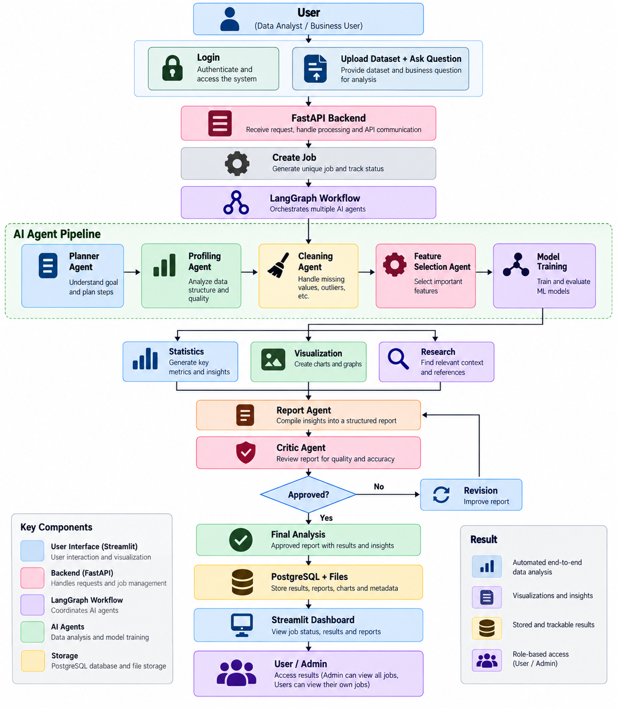

# Auto Analyst -- Autonomous Data Analysis Assistant

> An AI-powered, agentic data analysis platform that automates the
> end-to-end data analytics workflow from dataset upload and
> business-question understanding to data cleaning, feature selection,
> model training, visualization, reporting, validation, and final
> results.

------------------------------------------------------------------------

## 📌 Overview

**Auto Analyst** is an autonomous data analysis assistant designed for
**Data Analysts and Business Users** who want to analyze datasets
without manually performing every stage of the analytics workflow.

The system combines:

-   **Streamlit** for the user interface and dashboard
-   **FastAPI** for backend APIs and job management
-   **LangGraph** for orchestrating multiple AI agents
-   **Specialized AI agents** for different stages of analysis
-   **Python-based analytical pipelines** for data processing and
    machine learning
-   **PostgreSQL + file storage** for jobs, metadata, reports, charts,
    and results
-   **Role-based access control** for User and Admin access

The user provides a dataset and a business question. Auto Analyst then
coordinates the analysis workflow and produces structured results,
visualizations, insights, and a final report.

------------------------------------------------------------------------

## 🎯 Why Auto Analyst?

Traditional data analysis often requires users to manually perform
several steps:

1.  Understand the business question
2.  Inspect the dataset
3.  Check data quality
4.  Clean the data
5.  Select useful features
6.  Calculate statistics
7.  Train and evaluate models
8.  Create visualizations
9.  Research additional context when required
10. Prepare a report
11. Review the quality of the analysis

Auto Analyst brings these steps into one automated workflow.

### Key goal

> **Turn a dataset + business question into a structured, explainable
> analysis with minimal manual effort.**

------------------------------------------------------------------------

## ✨ Key Features

### 1. Dataset Upload & Business Question

Users can upload a dataset and provide a natural-language business
question.

Example:

> "Which customer segments are most likely to churn?"

The system uses the question to determine what analysis should be
performed.

### 2. Automated Data Profiling

The Profiling Agent examines:

-   Dataset structure
-   Columns and data types
-   Missing values
-   Data quality
-   Basic characteristics
-   Potential analytical issues

### 3. Automated Data Cleaning

The Cleaning Agent handles common data-quality problems such as:

-   Missing values
-   Duplicate records
-   Outliers
-   Inconsistent data
-   Other preprocessing requirements

### 4. Feature Selection

The Feature Selection Agent identifies important features relevant to
the analysis or modeling task.

### 5. Statistical Analysis

The Statistics Agent generates useful metrics and statistical insights
based on the dataset and business question.

### 6. Machine Learning

The Model Training Agent can train and evaluate suitable
machine-learning models when the task requires predictive analysis.

### 7. Visualization

The Visualization Agent creates charts and graphs to make analytical
results easier to understand.

### 8. Research

The Research Agent can find relevant context and references when
external business or domain context is required.

### 9. Automated Reporting

The Report Agent combines:

-   Analysis results
-   Statistics
-   Model results
-   Visualizations
-   Research context
-   Business insights

into a structured report.

### 10. Critic & Revision Loop

The Critic Agent reviews the generated report for quality and accuracy.

If the analysis is not approved:

``` text
Critic Agent
     ↓
Not Approved
     ↓
Revision
     ↓
Report Agent
     ↓
Critic Agent
```

The process continues until the report is approved.

### 11. Job Management

Each analysis is created as a job with a unique job ID and tracked
status.

Users can view their jobs and results, while administrators can access
all jobs according to their role permissions.

### 12. Role-Based Access Control

The system supports two primary roles:

  Role    Access
  ------- ---------------------------------------------
  User    Can view and manage their own analysis jobs
  Admin   Can view and manage jobs across users

------------------------------------------------------------------------

# 🏗️ System Architecture

The overall workflow is:

``` text
User
  ↓
Streamlit Frontend
  ↓
FastAPI Backend
  ↓
Create Job
  ↓
LangGraph Workflow
  ↓
AI Agents
  ↓
Data Analysis Pipeline
  ↓
Report + Visualizations + Results
  ↓
Critic / Revision
  ↓
Final Analysis
  ↓
PostgreSQL + File Storage
  ↓
Streamlit Dashboard
```

## Architecture Diagram



------------------------------------------------------------------------

# 🤖 AI Agent Workflow

The project uses specialized agents rather than one large AI component.

### Planner Agent

Understands the user's business question and creates an analysis plan.

### Profiling Agent

Analyzes the dataset structure and quality.

### Cleaning Agent

Prepares the dataset for downstream analysis.

### Feature Selection Agent

Identifies important features for the analysis.

### Model Training Agent

Trains and evaluates machine-learning models when required.

### Statistics Agent

Generates statistical metrics and insights.

### Visualization Agent

Creates charts and graphs.

### Research Agent

Finds relevant context and references.

### Report Agent

Compiles the outputs into a structured analytical report.

### Critic Agent

Reviews the report and triggers revision when necessary.

------------------------------------------------------------------------

# 🔄 End-to-End Workflow

``` text
1. User Login
       ↓
2. Upload Dataset + Ask Question
       ↓
3. FastAPI receives request
       ↓
4. Create Analysis Job
       ↓
5. LangGraph starts workflow
       ↓
6. Planner Agent
       ↓
7. Profiling Agent
       ↓
8. Cleaning Agent
       ↓
9. Feature Selection Agent
       ↓
10. Model Training Agent
       ↓
11. Statistics + Visualization + Research
       ↓
12. Report Agent
       ↓
13. Critic Agent
       ↓
14. Approved?
      ↙   ↘
    No     Yes
    ↓       ↓
 Revision  Final Analysis
    ↓       ↓
 Report   PostgreSQL + Files
 Agent      ↓
    └────→ Dashboard
```

------------------------------------------------------------------------

# 🧩 Project Structure

``` text
Auto-Analyst-Autonomous-Assistant/
│
├── frontend/
│   ├── app.py
│   ├── views/
│   └── ...
│
├── src/
│   ├── agent/
│   │   ├── __init__.py
│   │   ├── planner.py
│   │   ├── profiling_agent.py
│   │   ├── cleaning_agent.py
│   │   ├── feature_selection_agent.py
│   │   ├── statistics_agent.py
│   │   ├── model_training_agent.py
│   │   ├── visualization_agent.py
│   │   ├── report_agent.py
│   │   ├── research_agent.py
│   │   ├── critic_agent.py
│   │   ├── graph.py
│   │   ├── graph_state.py
│   │   ├── tools.py
│   │   └── rag_setup.py
│   │
│   ├── auth/
│   ├── db/
│   └── pipeline/
│       ├── cleaning_logic.py
│       ├── profiling_logic.py
│       ├── feature_selection_logic.py
│       ├── statistics_logic.py
│       ├── model_training_logic.py
│       ├── visualization_logic.py
│       └── report_formatting.py
│
├── data/
│
├── main.py
├── llm_config.py
├── requirements.txt
├── README.md
├── .env
└── .gitignore
```

### Folder Responsibilities

  Directory / File     Purpose
  -------------------- ----------------------------------------
  `frontend/`          Streamlit user interface and dashboard
  `src/agent/`         AI agents and LangGraph workflow
  `src/auth/`          Authentication and authorization
  `src/db/`            Database-related functionality
  `src/pipeline/`      Core data-analysis and ML logic
  `data/`              Dataset and generated analysis files
  `main.py`            FastAPI backend entry point
  `llm_config.py`      LLM configuration
  `requirements.txt`   Python dependencies
  `.env`               Environment configuration and secrets

------------------------------------------------------------------------

# 🛠️ Technology Stack

  Technology                             Purpose
  -------------------------------------- ------------------------------------
  Python                                 Core development language
  Streamlit                              Frontend and analytical dashboard
  FastAPI                                Backend API
  LangGraph                              Multi-agent workflow orchestration
  LangChain / LLM tools                  Agent and LLM integration
  Pandas                                 Data processing
  NumPy                                  Numerical operations
  Scikit-learn                           Machine learning and evaluation
  Matplotlib / visualization libraries   Data visualization
  PostgreSQL                             Persistent database storage
  Git / GitHub                           Version control

------------------------------------------------------------------------

# 🔐 Authentication & Authorization

Auto Analyst includes role-based access control.

### User

A normal user can:

-   Log in
-   Upload datasets
-   Create analysis jobs
-   View their jobs
-   View their results
-   Access their reports and visualizations
-   Manage their own jobs

### Admin

An administrator can:

-   Access the admin dashboard
-   View jobs across users
-   Manage jobs according to administrative permissions
-   Monitor the overall system

------------------------------------------------------------------------

# 💾 Data & Result Storage

The application uses **PostgreSQL and file storage** to maintain
analysis information.

Stored information can include:

-   Job metadata
-   Job status
-   User information
-   Analysis results
-   Reports
-   Generated charts
-   Dataset-related files
-   Model-related outputs

This allows analysis jobs to be tracked and revisited through the
dashboard.

------------------------------------------------------------------------

# 📊 Example Use Cases

Auto Analyst can be applied to different analytical scenarios,
including:

### Customer Analytics

> "Which customers are most likely to churn?"

### Sales Analytics

> "Which products generate the highest revenue?"

### Marketing Analytics

> "Which customer segments respond best to the campaign?"

### Healthcare Analytics

> "What factors are associated with the target outcome?"

### Financial Analytics

> "Which variables have the strongest relationship with loan default?"

The workflow adapts based on the dataset and business question.

------------------------------------------------------------------------

# 🚀 Installation

## 1. Clone the Repository

``` bash
git clone <https://github.com/sukhadak11/Auto-Analyst-Autonomous-Assistant.git>
cd Auto-Analyst-Autonomous-Assistant
```

## 2. Create a Virtual Environment

### Windows

``` bash
python -m venv venv
venv\Scripts\activate
```

### Linux / macOS

``` bash
python3 -m venv venv
source venv/bin/activate
```

## 3. Install Dependencies

``` bash
pip install -r requirements.txt
```

## 4. Configure Environment Variables

Create a `.env` file and add the required configuration, such as:

``` env
DATABASE_URL=<your-postgresql-connection>
OPENAI_API_KEY=<your-api-key>
```

Use the variables required by your current configuration and **never
commit secrets to GitHub**.

------------------------------------------------------------------------

# ▶️ Running the Application

## Start the FastAPI Backend

``` bash
uvicorn main:app --reload --port 8001
```

The backend handles API requests, job creation, processing
communication, and job management.

## Start the Streamlit Frontend

In another terminal:

``` bash
streamlit run frontend/app.py
```

Then open the Streamlit URL shown in the terminal.

------------------------------------------------------------------------

# 🧪 Testing

Before deploying the application, test the complete workflow:

``` text
Login
  ↓
Dataset Upload
  ↓
Question Submission
  ↓
Job Creation
  ↓
Agent Workflow
  ↓
Analysis
  ↓
Visualization
  ↓
Report
  ↓
Critic Review
  ↓
Approval / Revision
  ↓
Final Result
```

Also test:

-   User/Admin permissions
-   Job status updates
-   Job deletion
-   Database persistence
-   File cleanup
-   Different dataset formats
-   Different business questions
-   Visualization generation
-   Model evaluation
-   Error handling

------------------------------------------------------------------------

# 🔒 Security Considerations

-   Keep API keys and database credentials in `.env`.
-   Do not commit `.env` to GitHub.
-   Do not commit virtual environments.
-   Do not commit large temporary database files.
-   Validate uploaded files.
-   Apply role-based authorization to protected endpoints.
-   Restrict users to resources they are authorized to access.
-   Validate job ownership before user-level operations.

------------------------------------------------------------------------

# 📈 Future Improvements

Potential improvements include:

-   More specialized AI agents
-   Better automatic model selection
-   Advanced feature engineering
-   More visualization types
-   Improved report generation
-   Streaming agent execution status
-   More detailed audit logs
-   Automated model comparison
-   Export reports to PDF/Excel
-   Deployment using Docker
-   Cloud deployment
-   Automated testing and CI/CD
-   More granular permissions

------------------------------------------------------------------------

# 🌟 Project Highlights

The main strengths of Auto Analyst are:

-   **End-to-end automated data analysis**
-   **Multi-agent AI architecture**
-   **LangGraph-based workflow orchestration**
-   **Natural-language business-question understanding**
-   **Automated data profiling and cleaning**
-   **Machine-learning model training and evaluation**
-   **Automated visualizations and insights**
-   **Research-assisted analysis**
-   **Automated report generation**
-   **Critic and revision loop**
-   **Persistent job tracking**
-   **Role-based User/Admin access**
-   **Interactive Streamlit dashboard**

------------------------------------------------------------------------

# 👩‍💻 Project Summary

**Auto Analyst -- Autonomous Data Analysis Assistant** is a modular,
agentic AI platform that automates the data-analysis lifecycle.

Instead of requiring users to manually perform profiling, cleaning,
feature selection, statistical analysis, modeling, visualization, and
reporting, the platform coordinates specialized AI agents through a
**LangGraph workflow**.

The final system provides users with a structured analysis containing
**results, visualizations, insights, and reports**, while PostgreSQL and
file storage provide persistent and trackable job management.

------------------------------------------------------------------------

## 📄 License

Add your preferred license here, for example:

``` text
MIT License
```

------------------------------------------------------------------------

## 👤 Author

**Sukhada Khade**

-   GitHub: `https://github.com/sukhadak11`
